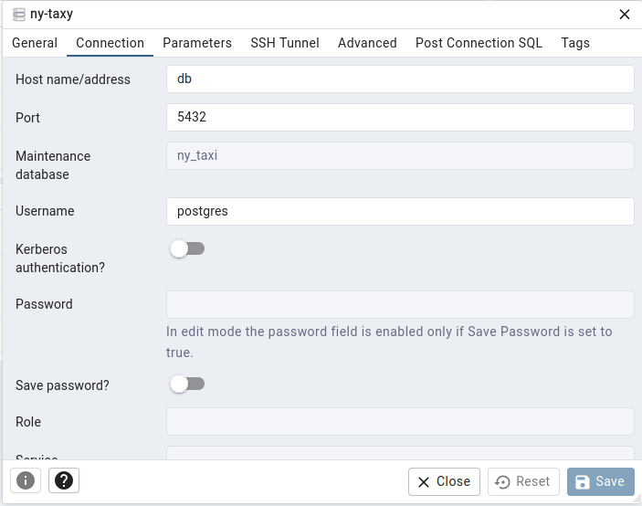

# Module 1 Homework: Docker & SQL

In this homework we'll prepare the environment and practice
Docker and SQL

When submitting your homework, you will also need to include
a link to your GitHub repository or other public code-hosting
site.

This repository should contain the code for solving the homework.

When your solution has SQL or shell commands and not code
(e.g. python files) file format, include them directly in
the README file of your repository.


## Question 1. Understanding Docker images

Run docker with the `python:3.13` image. Use an entrypoint `bash` to interact with the container.

What's the version of `pip` in the image?

- **25.3** (answer)
- 24.3.1
- 24.2.1
- 23.3.1


**steps:**
1. `docker run -it --rm python:3.13 bash`
2. `pip --version`

```
$ docker run -it --rm python:3.13 bash
root@b3963bdf5ac0:/# pip --version 
pip 25.3 from /usr/local/lib/python3.13/site-packages/pip (python 3.13)
root@b3963bdf5ac0:/#
```


## Question 2. Understanding Docker networking and docker-compose

Given the following `docker-compose.yaml`, what is the `hostname` and `port` that pgadmin should use to connect to the postgres database?

```yaml
services:
  db:
    container_name: postgres
    image: postgres:17-alpine
    environment:
      POSTGRES_USER: 'postgres'
      POSTGRES_PASSWORD: 'postgres'
      POSTGRES_DB: 'ny_taxi'
    ports:
      - '5433:5432'
    volumes:
      - vol-pgdata:/var/lib/postgresql/data

  pgadmin:
    container_name: pgadmin
    image: dpage/pgadmin4:latest
    environment:
      PGADMIN_DEFAULT_EMAIL: "pgadmin@pgadmin.com"
      PGADMIN_DEFAULT_PASSWORD: "pgadmin"
    ports:
      - "8080:80"
    volumes:
      - vol-pgadmin_data:/var/lib/pgadmin

volumes:
  vol-pgdata:
    name: vol-pgdata
  vol-pgadmin_data:
    name: vol-pgadmin_data
```

- postgres:5433
- localhost:5432
- db:5433
- postgres:5432
- **db:5432** (answer)

If multiple answers are correct, select any 





**Explanation:**

- **Hostname**: In Docker Compose, all services defined in the same `docker-compose.yaml` file are automatically connected to a default network. Docker's internal DNS allows containers to resolve other services by their service name. Therefore, `pgadmin` can reach the database using the hostname `db`.
- **Port**: The `ports` definition `5433:5432` maps the host machine's port `5433` to the container's port `5432`. This mapping is for external access (from your physical computer). For communication *between* containers on the same Docker network, they use the internal container port, which is `5432`.


## Prepare the Data

Download the green taxi trips data for November 2025:

```bash
wget https://d37ci6vzurychx.cloudfront.net/trip-data/green_tripdata_2025-11.parquet
```

You will also need the dataset with zones:

```bash
wget https://github.com/DataTalksClub/nyc-tlc-data/releases/download/misc/taxi_zone_lookup.csv
```

## Question 3. Counting short trips

For the trips in November 2025 (lpep_pickup_datetime between '2025-11-01' and '2025-12-01', exclusive of the upper bound), how many trips had a `trip_distance` of less than or equal to 1 mile?

- 7,853
- **8,007** (answer)
- 8,254
- 8,421


**code solution**

```python
import polars as pl

df = pl.read_parquet("data/raw/green_tripdata_2025-11.parquet")

filtered_data = df.filter(
    pl.col('lpep_pickup_datetime') >= datetime.strptime('2025-11-01', '%Y-%m-%d'),
    pl.col('lpep_pickup_datetime') <= datetime.strptime('2025-12-01', '%Y-%m-%d'),
    pl.col('trip_distance') <= 1
)
count_filtered_data = filtered_data.shape[0]

print(count_filtered_data)

```

## Question 4. Longest trip for each day

Which was the pick up day with the longest trip distance? Only consider trips with `trip_distance` less than 100 miles (to exclude data errors).

Use the pick up time for your calculations.

- **2025-11-14** (answer)
- 2025-11-20
- 2025-11-23
- 2025-11-25


```python
import polars as pl

df = pl.read_parquet("data/raw/green_tripdata_2025-11.parquet")

longest_trip_day = (
    df.filter(pl.col('trip_distance') < 100)
    .group_by(pl.col("lpep_pickup_datetime").dt.date())
    .agg(pl.max("trip_distance"))
    .sort("trip_distance", descending=True)
    .limit(1)
)

print(longest_trip_day)
```

output: 


```plain
┌──────────────────────┬───────────────┐
│ lpep_pickup_datetime ┆ trip_distance │
│ ---                  ┆ ---           │
│ date                 ┆ f64           │
╞══════════════════════╪═══════════════╡
│ 2025-11-14           ┆ 88.03         │
└──────────────────────┴───────────────┘
```


## Question 5. Biggest pickup zone

Which was the pickup zone with the largest `total_amount` (sum of all trips) on November 18th, 2025?

- **East Harlem North** (answer)
- East Harlem South
- Morningside Heights
- Forest Hills

**solsolution**t

```python
import polars as pl

df = pl.read_parquet("data/raw/green_tripdata_2025-11.parquet")
df_zones = pl.read_csv("data/raw/taxi_zone_lookup.csv")

largest_amount_zone = (
    df.filter(pl.col("lpep_pickup_datetime").dt.date() == pl.date(2025, 11, 18))
    .group_by("PULocationID")
    .agg(pl.sum("total_amount"))
    .join(df_zones, left_on="PULocationID", right_on="LocationID")
    .sort("total_amount", descending=True)
    .limit(1)
)

print(largest_amount_zone)
```

output:


```plain
shape: (1, 5)
┌──────────────┬──────────────┬───────────┬───────────────────┬──────────────┐
│ PULocationID ┆ total_amount ┆ Borough   ┆ Zone              ┆ service_zone │
│ ---          ┆ ---          ┆ ---       ┆ ---               ┆ ---          │
│ i32          ┆ f64          ┆ str       ┆ str               ┆ str          │
╞══════════════╪══════════════╪═══════════╪═══════════════════╪══════════════╡
│ 74           ┆ 9281.92      ┆ Manhattan ┆ East Harlem North ┆ Boro Zone    │
└──────────────┴──────────────┴───────────┴───────────────────┴──────────────┘
```


## Question 6. Largest tip

For the passengers picked up in the zone named "East Harlem North" in November 2025, which was the drop off zone that had the largest tip?

Note: it's `tip` , not `trip`. We need the name of the zone, not the ID.

- JFK Airport
- **Yorkville West** (answer)
- East Harlem North
- LaGuardia Airport


**solition**

```python
import polars as pl

df = pl.read_parquet("data/raw/green_tripdata_2025-11.parquet")
df_zones = pl.read_csv("data/raw/taxi_zone_lookup.csv")

largest_tip_zone = (
    df.join(df_zones, left_on="PULocationID", right_on="LocationID")
    .filter(pl.col("Zone") == "East Harlem North")
    .sort("tip_amount", descending=True)
    .limit(1)
    .join(df_zones, left_on="DOLocationID", right_on="LocationID", suffix="_dropoff")
    .select(pl.col("Zone_dropoff"))
)

print(largest_tip_zone)
```

output:

```plain
shape: (1, 1)
┌────────────────┐
│ Zone_dropoff   │
│ ---            │
│ str            │
╞════════════════╡
│ Yorkville West │
└────────────────┘

```


## Terraform

In this section homework we'll prepare the environment by creating resources in GCP with Terraform.

In your VM on GCP/Laptop/GitHub Codespace install Terraform.
Copy the files from the course repo
[here](../../../01-docker-terraform/terraform/terraform) to your VM/Laptop/GitHub Codespace.

Modify the files as necessary to create a GCP Bucket and Big Query Dataset.


## Question 7. Terraform Workflow

Which of the following sequences, respectively, describes the workflow for:
1. Downloading the provider plugins and setting up backend,
2. Generating proposed changes and auto-executing the plan
3. Remove all resources managed by terraform`

Answers:
- terraform import, terraform apply -y, terraform destroy
- teraform init, terraform plan -auto-apply, terraform rm
- terraform init, terraform run -auto-approve, terraform destroy
- **`terraform init`, `terraform apply -auto-approve`, `terraform destroy`** (answer)
- terraform import, terraform apply -y, terraform rm


## Submitting the solutions

* Form for submitting: https://courses.datatalks.club/de-zoomcamp-2026/homework/hw1


## Learning in Public

We encourage everyone to share what they learned. This is called "learning in public".

### Why learn in public?

- Accountability: Sharing your progress creates commitment and motivation to continue
- Feedback: The community can provide valuable suggestions and corrections
- Networking: You'll connect with like-minded people and potential collaborators
- Documentation: Your posts become a learning journal you can reference later
- Opportunities: Employers and clients often discover talent through public learning

You can read more about the benefits [here](https://alexeyondata.substack.com/p/benefits-of-learning-in-public-and).

Don't worry about being perfect. Everyone starts somewhere, and people love following genuine learning journeys!

### Example post for LinkedIn

```
🚀 Week 1 of Data Engineering Zoomcamp by @DataTalksClub complete!

Just finished Module 1 - Docker & Terraform. Learned how to:

✅ Containerize applications with Docker and Docker Compose
✅ Set up PostgreSQL databases and write SQL queries
✅ Build data pipelines to ingest NYC taxi data
✅ Provision cloud infrastructure with Terraform

Here's my homework solution: <LINK>

Following along with this amazing free course - who else is learning data engineering?

You can sign up here: https://github.com/DataTalksClub/data-engineering-zoomcamp/
```

### Example post for Twitter/X


```
🐳 Module 1 of Data Engineering Zoomcamp done!

- Docker containers
- Postgres & SQL
- Terraform & GCP
- NYC taxi data pipeline

My solution: <LINK>

Free course by @DataTalksClub: https://github.com/DataTalksClub/data-engineering-zoomcamp/
```


