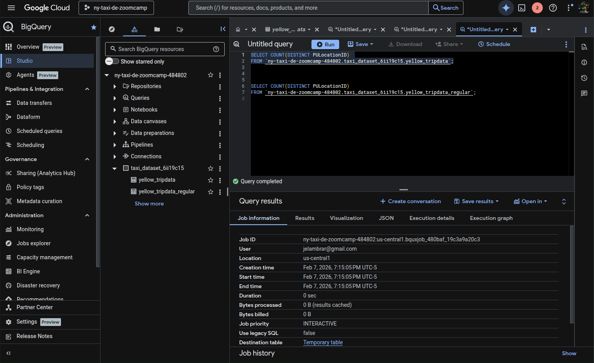
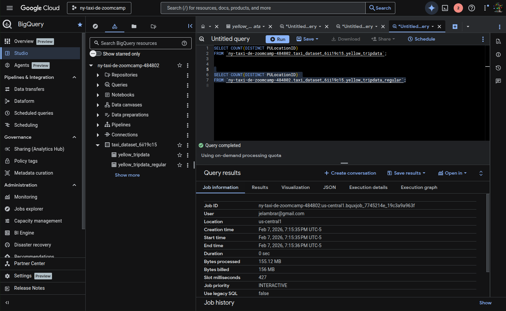
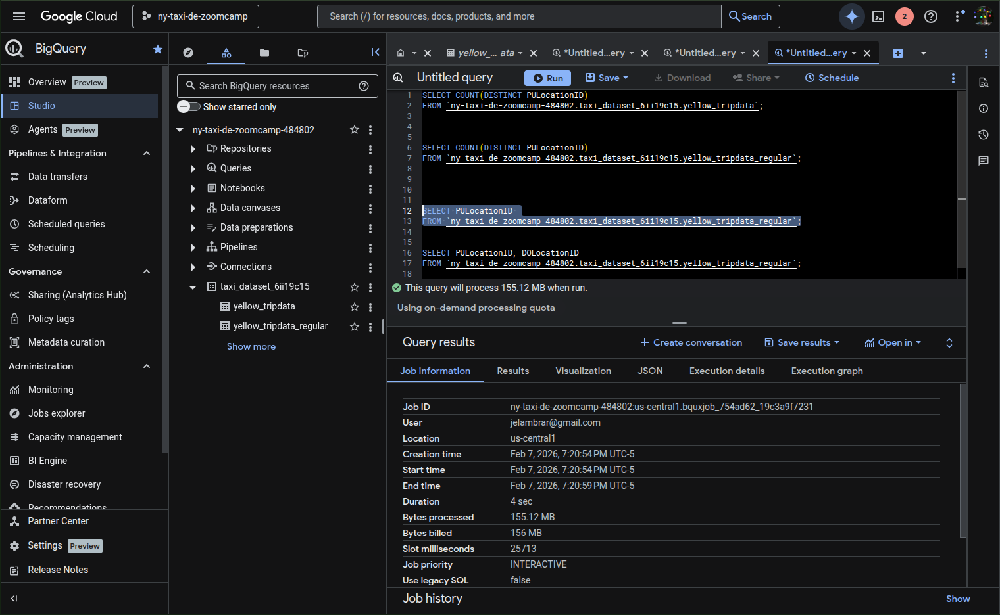
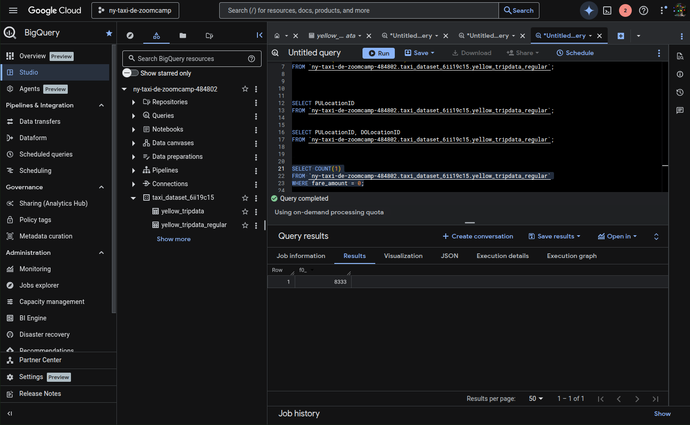
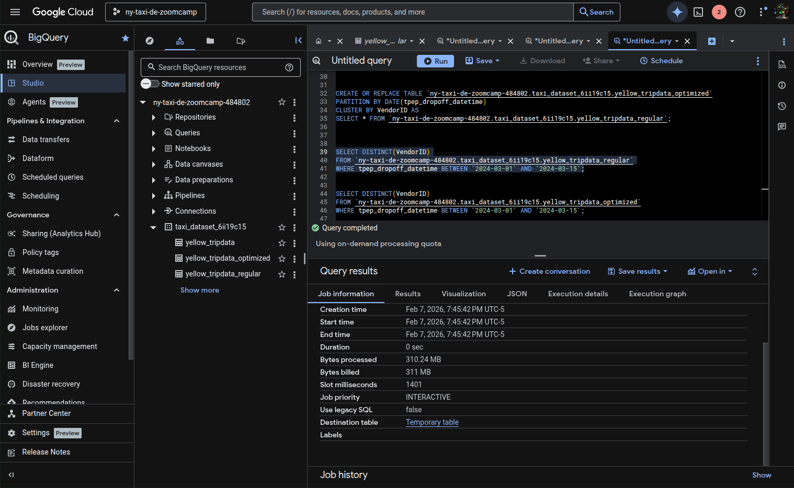
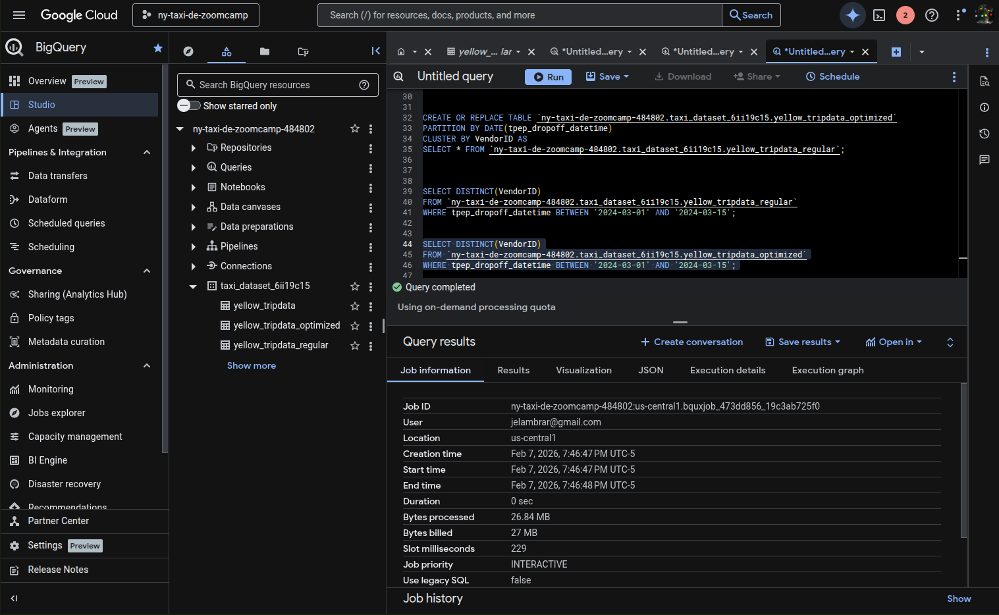
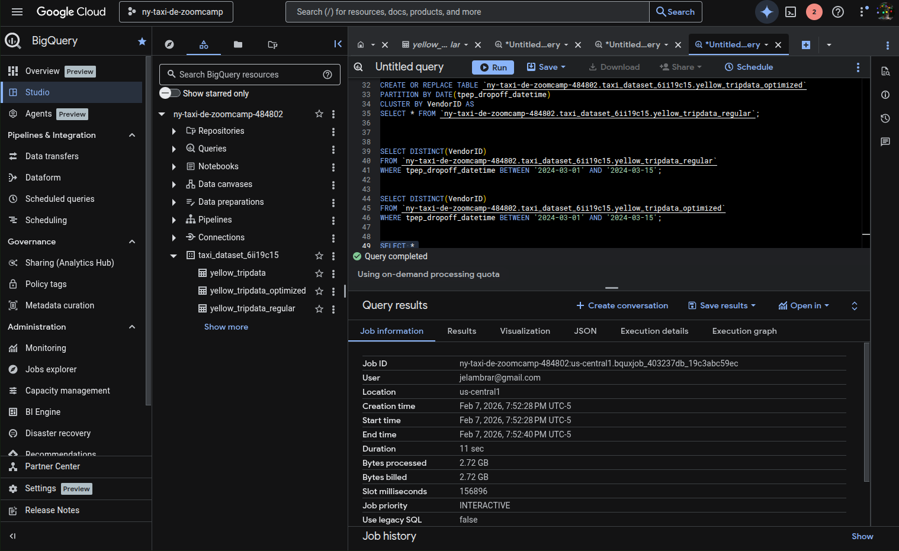

## [DRAFT] Module 3 Homework

ATTENTION: At the end of the submission form, you will be required to include a link to your GitHub repository or other public code-hosting site. 
This repository should contain your code for solving the homework. If your solution includes code that is not in file format (such as SQL queries or 
shell commands), please include these directly in the README file of your repository.

<b><u>Important Note:</b></u> <p> For this homework we will be using the Yellow Taxi Trip Records for **January 2024 - June 2024 NOT the entire year of data** 
Parquet Files from the New York
City Taxi Data found here: </br> https://www.nyc.gov/site/tlc/about/tlc-trip-record-data.page </br>
If you are using orchestration such as Kestra, Mage, Airflow or Prefect etc. do not load the data into Big Query using the orchestrator.</br> 
Stop with loading the files into a bucket. </br></br>

**Load Script:** You can manually download the parquet files and upload them to your GCS Bucket or you can use the linked script [here](./load_yellow_taxi_data.py):<br>
You will simply need to generate a Service Account with GCS Admin Priveleges or be authenticated with the Google SDK and update the bucket name in the script to the name of your bucket<br>
Nothing is fool proof so make sure that all 6 files show in your GCS Bucket before beginning.</br><br>

<u>NOTE:</u> You will need to use the PARQUET option files when creating an External Table</br>

<b>BIG QUERY SETUP:</b></br>
Create an external table using the Yellow Taxi Trip Records. </br>
Create a (regular/materialized) table in BQ using the Yellow Taxi Trip Records (do not partition or cluster this table). </br>
</p>


**Phase 1: Create the External Table**

This table acts as a "window" to your GCS bucket. The data remains in GCS, but you can query it via SQL.

1. Open the **BigQuery Console**.
2. In the **Explorer** panel, click the three dots (⋮) next to your Dataset name and select **Create table**.
3. Under Source:
    1. **Create table from**: Select Google Cloud Storage.
    2. **Select file from GCS bucket**: Use a wildcard to capture all 6 months: `your-bucket-name/yellow_tripdata_2024-*.parquet`.
    3. **File format**: Select Parquet.
4. Under **Destination**:
    1. **Table name**: Enter external_yellow_taxi_2024.
5. Under Schema:
    1. Check the box for **Auto detect**.
6. Click **Create Table**.


**Phase 2: Create the Regular (Native) Table**

Now you will move the data from the external table into BigQuery's managed storage. The instructions specify no partitioning or clustering.

1. Open a new **SQL Query** tab in the BigQuery console.
2. Run the following CREATE TABLE (CTAS) statement:

```sql
CREATE OR REPLACE TABLE `your_project_id.your_dataset_id.yellow_taxi_2024_regular` AS
SELECT * FROM `your_project_id.your_dataset_id.external_yellow_taxi_2024`;
```

Replace `your_project_id` and `your_dataset_id` with your actual IDs.


**Verification**

Once both tables are created, you should verify the record counts to ensure all 6 months were loaded correctly.
Count External Table:

```sql
SELECT count(*) FROM `your_dataset_id.external_yellow_taxi_2024`;
```

Count Regular Table:

```sql
SELECT count(*) FROM `your_dataset_id.yellow_taxi_2024_regular`;
```


## Question 1:
What is count of records for the 2024 Yellow Taxi Data?
- 65,623
- 840,402
- **20,332,093** (answer)
- 85,431,289


## Question 2:
Write a query to count the distinct number of PULocationIDs for the entire dataset on both the tables.</br> 
What is the **estimated amount** of data that will be read when this query is executed on the External Table and the Table?

- 18.82 MB for the External Table and 47.60 MB for the Materialized Table
- **0 MB for the External Table and 155.12 MB for the Materialized Table** (answer)
- 2.14 GB for the External Table and 0MB for the Materialized Table
- 0 MB for the External Table and 0MB for the Materialized Table







## Question 3:
Write a query to retrieve the PULocationID from the table (not the external table) in BigQuery. Now write a query to retrieve the PULocationID and DOLocationID on the same table. Why are the estimated number of Bytes different?
- **BigQuery is a columnar database, and it only scans the specific columns requested in the query. Querying two columns (PULocationID, DOLocationID) requires reading more data than querying one column (PULocationID), leading to a higher estimated number of bytes processed.** (answer)
- BigQuery duplicates data across multiple storage partitions, so selecting two columns instead of one requires scanning the table twice, doubling the estimated bytes processed.
- BigQuery automatically caches the first queried column, so adding a second column increases processing time but does not affect the estimated bytes scanned.
- When selecting multiple columns, BigQuery performs an implicit join operation between them, increasing the estimated bytes processed





## Question 4:
How many records have a fare_amount of 0?
- 128,210
- 546,578
- 20,188,016
- **8,333** (answer)





## Question 5:
What is the best strategy to make an optimized table in Big Query if your query will always filter based on **tpep_dropoff_datetime** and order the results by **VendorID** (Create a new table with this strategy)
- **Partition by tpep_dropoff_datetime and Cluster on VendorID**
- Cluster on by tpep_dropoff_datetime and Cluster on VendorID
- Cluster on tpep_dropoff_datetime Partition by VendorID
- Partition by tpep_dropoff_datetime and Partition by VendorID

```sql
CREATE OR REPLACE TABLE `ny-taxi-de-zoomcamp-484802.taxi_dataset_6ii19c15.yellow_tripdata_optimized`
PARTITION BY DATE(tpep_dropoff_datetime)
CLUSTER BY VendorID AS
SELECT * FROM `ny-taxi-de-zoomcamp-484802.taxi_dataset_6ii19c15.external_yellow_taxi_2024`;
```


## Question 6:
Write a query to retrieve the distinct VendorIDs between tpep_dropoff_datetime
2024-03-01 and 2024-03-15 (inclusive)</br>

Use the materialized table you created earlier in your from clause and note the estimated bytes. Now change the table in the from clause to the partitioned table you created for question 5 and note the estimated bytes processed. What are these values? </br>

Choose the answer which most closely matches.</br> 

- 12.47 MB for non-partitioned table and 326.42 MB for the partitioned table
- **310.24 MB for non-partitioned table and 26.84 MB for the partitioned table** (answer)
- 5.87 MB for non-partitioned table and 0 MB for the partitioned table
- 310.31 MB for non-partitioned table and 285.64 MB for the partitioned table







## Question 7: 
Where is the data stored in the External Table you created?

- Big Query
- Container Registry
- **GCP Bucket** (answer)
- Big Table

## Question 8:
It is best practice in Big Query to always cluster your data:
- True
- **False** (anwer)


While clustering is a powerful optimization tool, it is not a best practice to "always" use it for every table. Here is why:

1. **Table Size Matters**: For small tables (typically under 100 MB), the performance gains from clustering are negligible.
2. **Query Patterns**: Clustering is only effective if you frequently filter or sort by the specific columns you’ve clustered. If your queries use different columns, clustering provides no benefit and may even slightly slow down data ingestion.
3. **Maintenance & Costs**: While BigQuery performs automatic re-clustering in the background to maintain performance, this process can involve costs for very large, frequently updated datasets.


## (Bonus: Not worth points) Question 9:
No Points: Write a `SELECT count(*)` query FROM the materialized table you created. How many bytes does it estimate will be read? Why?





## Submitting the solutions

Form for submitting: https://courses.datatalks.club/de-zoomcamp-2026/homework/hw3

## Solution

Solution: https://www.youtube.com/watch?v=wpLmImIUlPg


## Learning in Public

We encourage everyone to share what they learned. This is called "learning in public".

Read more about the benefits [here](https://alexeyondata.substack.com/p/benefits-of-learning-in-public-and).

### Example post for LinkedIn

```
🚀 Week 3 of Data Engineering Zoomcamp by @DataTalksClub complete!

Just finished Module 3 - Data Warehousing with BigQuery. Learned how to:

✅ Create external tables from GCS bucket data
✅ Build materialized tables in BigQuery
✅ Partition and cluster tables for performance
✅ Understand columnar storage and query optimization
✅ Analyze NYC taxi data at scale

Working with 20M+ records and learning how partitioning reduces query costs!

Here's my homework solution: <LINK>

Following along with this amazing free course - who else is learning data engineering?

You can sign up here: https://github.com/DataTalksClub/data-engineering-zoomcamp/
```

### Example post for Twitter/X

```
📊 Module 3 of Data Engineering Zoomcamp done!

- BigQuery & GCS
- External vs materialized tables
- Partitioning & clustering
- Query optimization

My solution: <LINK>

Free course by @DataTalksClub: https://github.com/DataTalksClub/data-engineering-zoomcamp/
```
