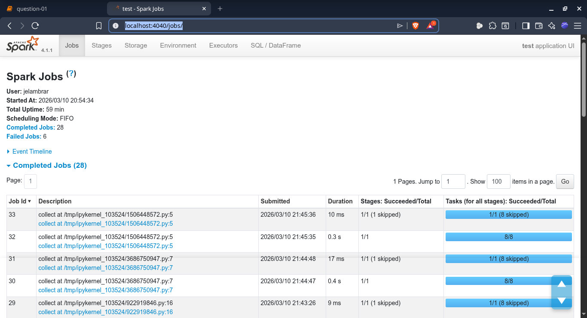

# Module 6 Homework

In this homework we'll put what we learned about Spark in practice.

For this homework we will be using the Yellow 2025-11 data from the official website:

```bash
wget https://d37ci6vzurychx.cloudfront.net/trip-data/yellow_tripdata_2025-11.parquet
```


## Question 1: Install Spark and PySpark

- Install Spark
- Run PySpark
- Create a local spark session
- Execute spark.version.

What's the output?

> [!NOTE]
> To install PySpark follow this [guide](https://github.com/DataTalksClub/data-engineering-zoomcamp/blob/main/06-batch/setup/)

```plain
Spark version: 4.1.1
```

## Question 2: Yellow November 2025

Read the November 2025 Yellow into a Spark Dataframe.

Repartition the Dataframe to 4 partitions and save it to parquet.

What is the average size of the Parquet (ending with .parquet extension) Files that were created (in MB)? Select the answer which most closely matches.

- 6MB
- **25MB** (ANSWER)
- 75MB
- 100MB

```
$ ll -lh 
total 104M
-rw-r--r--. 1 jelambrar jelambrar 26M Mar 10 21:31 part-00000-f73bffeb-050d-4ca9-9443-49bef0fed85d-c000.snappy.parquet
-rw-r--r--. 1 jelambrar jelambrar 26M Mar 10 21:31 part-00001-f73bffeb-050d-4ca9-9443-49bef0fed85d-c000.snappy.parquet
-rw-r--r--. 1 jelambrar jelambrar 26M Mar 10 21:31 part-00002-f73bffeb-050d-4ca9-9443-49bef0fed85d-c000.snappy.parquet
-rw-r--r--. 1 jelambrar jelambrar 26M Mar 10 21:31 part-00003-f73bffeb-050d-4ca9-9443-49bef0fed85d-c000.snappy.parquet
-rw-r--r--. 1 jelambrar jelambrar   0 Mar 10 21:31 _SUCCESS
```

## Question 3: Count records

How many taxi trips were there on the 15th of November?

Consider only trips that started on the 15th of November.

- 62,610
- 102,340
- **162,604** 
- 225,768

```python
input_path = f'data/pq/type=yellow/'

df_yellow = spark.read \
    .schema(yellow_schema) \
    .parquet(input_path)
```

```python
df_yellow.createOrReplaceTempView("yellow_trips")

trip_count = spark.sql("""
    SELECT COUNT(*) as trip_count
    FROM yellow_trips
    WHERE 1 = 1
    AND DAY(tpep_pickup_datetime) = 15 
    AND MONTH(tpep_pickup_datetime) = 11
    AND YEAR(tpep_pickup_datetime) = 2025
""").collect()

print(f"Taxi trips on November 15th: {trip_count}")
```

```plain
Taxi trips on November 15th: [Row(trip_count=166857)]
```


## Question 4: Longest trip

What is the length of the longest trip in the dataset in hours?

- 22.7
- 58.2
- 90.6
- 134.5

```python
max_duration = df_yellow.agg(
    F.max(
        (F.unix_timestamp("tpep_dropoff_datetime") - F.unix_timestamp("tpep_pickup_datetime")) / 3600
    ).alias("max_hours")
).collect()

print(f"Longest trip duration: {max_duration} hours")
```

```plain
Longest trip duration: [Row(max_hours=90.64666666666666)] hours
```

## Question 5: User Interface

Spark's User Interface which shows the application's dashboard runs on which local port?

- 80
- 443
- **4040** (ANSWER)
- 8080

```plain
http://localhost:4040/jobs/
```



## Question 6: Least frequent pickup location zone

Load the zone lookup data into a temp view in Spark:

```bash
wget https://d37ci6vzurychx.cloudfront.net/misc/taxi_zone_lookup.csv
```

Using the zone lookup data and the Yellow November 2025 data, what is the name of the LEAST frequent pickup location Zone?

- Governor's Island/Ellis Island/Liberty Island
- **Arden Heights**
- Rikers Island
- Jamaica Bay

If multiple answers are correct, select any

```python
df_zones = spark.read \
    .option("header", "true") \
    .csv('data/taxi_zone_lookup.csv')
```

```python
from pyspark.sql import functions as F

# Join yellow trips with zone lookup on pickup location
df_pickup_zones = df_yellow.join(
    df_zones,
    df_yellow.PULocationID == df_zones.LocationID,
    "left"
)

# Count trips by zone and sort to find the least frequent
least_frequent_zone = df_pickup_zones\
    .groupBy("Zone")\
    .count() \
    .orderBy(F.col("Zone").asc()) \
    .orderBy(F.col("count").asc()) \
    .limit(10)

least_frequent_zone.show()
```

```plain
+--------------------+-----+
|                Zone|count|
+--------------------+-----+
|       Arden Heights|    1|
|Eltingville/Annad...|    1|
|Governor's Island...|    1|
|       Port Richmond|    3|
|         Great Kills|    4|
| Green-Wood Cemetery|    4|
|       Rikers Island|    4|
|   Rossville/Woodrow|    4|
|         Jamaica Bay|    5|
|         Westerleigh|   12|
+--------------------+-----+
```


## Submitting the solutions

- Form for submitting: https://courses.datatalks.club/de-zoomcamp-2026/homework/hw6
- Deadline: See the website


## Learning in Public

We encourage everyone to share what they learned. This is called "learning in public".

Read more about the benefits [here](https://alexeyondata.substack.com/p/benefits-of-learning-in-public-and).

### Example post for LinkedIn

```
🚀 Week 6 of Data Engineering Zoomcamp by @DataTalksClub complete!

Just finished Module 6 - Batch Processing with Spark. Learned how to:

✅ Set up PySpark and create Spark sessions
✅ Read and process Parquet files at scale
✅ Repartition data for optimal performance
✅ Analyze millions of taxi trips with DataFrames
✅ Use Spark UI for monitoring jobs

Processing 4M+ taxi trips with Spark - distributed computing is powerful! 💪

Here's my homework solution: <LINK>

Following along with this amazing free course - who else is learning data engineering?

You can sign up here: https://github.com/DataTalksClub/data-engineering-zoomcamp/
```

### Example post for Twitter/X

```
⚡ Module 6 of Data Engineering Zoomcamp done!

- Batch processing with Spark 🔥
- PySpark & DataFrames
- Parquet file optimization
- Spark UI on port 4040

My solution: <LINK>

Free course by @DataTalksClub: https://github.com/DataTalksClub/data-engineering-zoomcamp/
```
